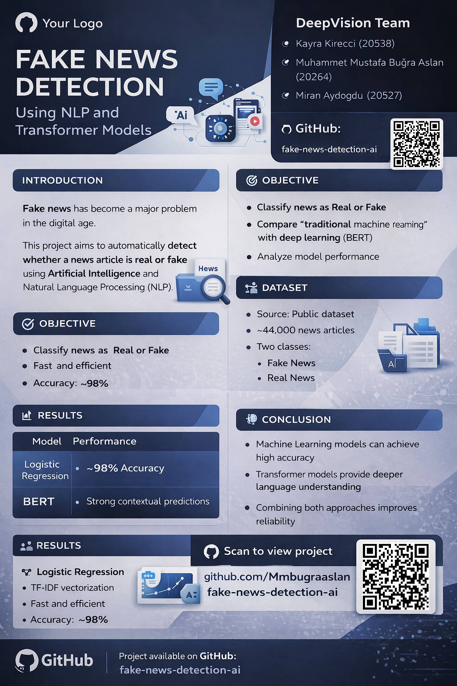

# Fake News Detection Using NLP and Transformer Models

## 📊 Project Poster

## 📌 Project Overview

This project focuses on detecting whether a news article is **real or fake** using Natural Language Processing (NLP) techniques. 

We implemented and compared two different approaches:
- Logistic Regression (traditional Machine Learning)
- BERT (Transformer-based Deep Learning)

---

## 📂 Dataset

We used a public dataset containing real and fake news articles:
- Fake.csv → Fake news
- True.csv → Real news

Total dataset size: ~44,000 articles

---

## ⚙️ Methods

### 1. Logistic Regression
- Text vectorization using TF-IDF
- Model: Logistic Regression
- Achieved high accuracy (~98%)

### 2. BERT (Transformer Model)
- Model: DistilBERT (pretrained)
- Fine-tuned on dataset
- Provides contextual understanding of text

---

## 🚀 How to Run

### 1. Install dependencies
pip install pandas numpy scikit-learn transformers torch datasets accelerate

### 2. Run Logistic Regression model
python main.py

### 3. Train BERT model
python bert_train.py

### 4. Run BERT demo prediction
python bert_predict.py

---

## 📊 Results

- Logistic Regression achieved ~98% accuracy
- BERT successfully trained on dataset
- Demonstrated strong contextual understanding

---

## 🧠 Conclusion

This project demonstrates that:
- Traditional ML models can perform strongly in text classification tasks
- Transformer models provide deeper understanding of language
- Combining both approaches improves overall system performance

---

## 👥 Team

**DeepVision Team**

| Name                         | Index No | Role |
|-----------------------------|----------|------|
| Kayra Kireçci               | 20538    | Data Preparation & Presentation |
| Muhammet Mustafa Buğra Aslan| 20264    | Model Development (ML & BERT) |
| Miran Aydogdu               | 20527    | Research, Topic Selection & Presentation |

---

## 🔗 Notes

- Model training was performed locally
- Results folder may remain empty (training was done in-memory)
- This project demonstrates both traditional and deep learning approaches
